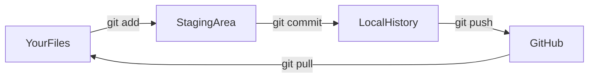

# AI Learning Path: From Chatbot to Agentic AI

## Where You Are Now

- Strong SQL analyst, comfortable with Tableau/Excel/Databricks
- Using AI as a chatbot (ask question, get answer)
- Basic familiarity editing AI-generated code, new to terminal/Git

## Where You're Going

- Directing AI agents to build tools for you (the ov-todo model: you're the product owner, AI is the engineer)
- Fluent in Git workflows, comfortable in the terminal
- Able to speak about agentic AI with clarity and confidence

## The Big Idea

The ov-todo project you shared is the perfect blueprint. The product owner didn't write code — they provided **vision, requirements, data knowledge, and feedback**. That is the skill you're building. Your domain expertise (data sources, metrics, what matters) is the hard part. AI handles the implementation.

---

## Phase 0: Setup and Orientation (Day 1)

**Goal:** Get your workspace ready so nothing blocks you later.

**Tasks:**

- Create a personal GitHub account (github.com) if you don't have one
- Install Git for Windows (comes with Git Bash — a better terminal than PowerShell for learning)
- Configure Git with your name/email
- Create your first repo on GitHub: `learning-ai`
- Clone it locally into this workspace
- Make a first commit (even just a README) so the full cycle clicks

**Key Concept — Git in Plain English:**



Git is just a save-point system. You make changes, stage them, commit (save a snapshot), and push (upload to GitHub). That's 90% of what you need.

---

## Phase 1: Terminal and Git Basics by Doing (Days 2-3)

**Goal:** Get comfortable enough with the terminal and Git that they don't slow you down.

**Project: Build a "cheat sheet" file using only the terminal and Git**

Instead of reading tutorials, you'll learn commands by using them. Cursor's AI (and Claude CLI) can tell you what command to run — you just need to understand what you're asking for.

**What you'll practice:**

- `cd`, `ls`, `mkdir`, `pwd` — navigating folders
- `git add`, `git commit`, `git push`, `git pull`, `git status`, `git log` — the daily Git workflow
- Creating branches and merging (the collaboration pattern)

**What "agentic" looks like here:** Instead of Googling "how do I rename a file in terminal," you ask Cursor or Claude CLI. Notice the difference — you're already using AI as a tool, not just a search engine.

---

## Phase 2: Understanding Agentic AI (Days 4-5)

**Goal:** Build a mental model of what "agentic AI" means so you can talk about it clearly.

**No project here — this is a concepts module, but still interactive.** You'll use Cursor/Claude to have a structured conversation and build a reference document.

**Key concepts to cover (we'll build a glossary together):**

- **Chatbot vs Agent:** A chatbot answers questions. An agent takes actions — it can read files, run code, search the web, call APIs, and decide what to do next.
- **Tools / Function Calling:** How agents interact with the real world (e.g., the MCP servers you already have configured for NVBugs, GitLab, Google Drive)
- **Context Window:** The agent's "working memory" — why it matters, why you sometimes need to re-explain things
- **Prompt Engineering vs Product Ownership:** Writing good prompts is a start, but the real skill is being a good product owner — clear requirements, good feedback, iterative refinement
- **Pros and Cons of Agentic AI:**
  - Pros: Speed, handles boilerplate, can work across tools/APIs, democratizes engineering
  - Cons: Can confidently produce wrong answers, needs verification, context limits, security considerations, cost
- **MCP (Model Context Protocol):** You already have MCP servers for NVBugs, GitLab, Google Drive, OneDrive, and SharePoint. These are "tools" that AI agents can call.

**Deliverable:** A `concepts/agentic-ai-glossary.md` file in your repo that you wrote (with AI help) in your own words.

---

## Phase 3: Your First AI-Built Tool (Days 6-10)

**Goal:** Experience the "product owner directing AI" workflow by building something useful for your actual job.

**Project: A Python script that analyzes data you care about**

Starting small and practical. Pick one of these (or similar):

- **Option A:** A script that reads a CSV export of your adoption metrics and produces a summary report (top-line numbers, trends, charts)
- **Option B:** A script that connects to a SQL source and generates a formatted output (e.g., weekly download counts by product)
- **Option C:** A script that takes NVBugs data (via the MCP server you already have!) and summarizes ticket velocity

**How you'll build it:**

1. Describe what you want in plain English to Cursor (Agent mode)
2. Cursor writes the code
3. You run it, see what happens, give feedback
4. Iterate until it works

**This is the core loop.** You're not learning to code — you're learning to direct an AI coder. Your SQL brain is your superpower here: you already think in data transformations, filters, and aggregations. You just describe them and AI writes the Python.

**What you'll learn along the way:**

- How to run Python scripts
- How to install packages (`pip install`)
- How to read error messages (AI will help you fix them)
- How to iterate with feedback (the most important agentic AI skill)

---

## Phase 4: Dashboarding with AI (Days 11-18)

**Goal:** Build something visual — closer to the ov-todo north star.

**Project: A local web dashboard for one of your datasets**

This is where it gets exciting. You'll direct Cursor to build a simple web-based dashboard (HTML + Python backend) that visualizes one of your real datasets. Think of it as a mini version of one page from ov-todo.

**Suggested approach:**

- Use Streamlit or Dash (Python frameworks that make web dashboards easy — no HTML/CSS needed)
- Start with a CSV or SQL data source you already have
- Build charts similar to what you'd build in Tableau, but in code
- Add filters, date ranges, maybe a search

**Why this matters:** This is the exact workflow the ov-todo product owner used. They didn't learn web development — they described dashboards and directed AI to build them. Your Tableau experience means you already know what good dashboards look like.

**Git milestone:** Push this to your GitHub repo. Create a proper README describing what it does.

---

## Phase 5: GitLab + Real Integration (Days 19-25)

**Goal:** Set up your NVIDIA GitLab workflow and connect to real data sources.

**Tasks:**

- Set up a project on NVIDIA GitLab
- Learn the GitLab workflow (branches, merge requests — GitLab's version of pull requests)
- Understand CI/CD at a conceptual level (automated testing and deployment)

**Project: Enhance your dashboard with a live data connection**

- Connect to NVBugs via the MCP tools or API
- Or connect to Databricks/SQL
- Make the dashboard auto-refresh or pull live data
- Deploy it somewhere your team can see it (even a shared server)

---

## Phase 6: Advanced Agentic Patterns (Days 26+)

**Goal:** Understand the frontier — what's possible and where this is all heading.

**Topics:**

- **Claude CLI:** Using AI from the terminal for quick tasks, scripting, automation
- **MCP in depth:** You already have NVBugs, GitLab, Google Drive, OneDrive, and SharePoint MCP servers. Learn to chain them together (e.g., "find bugs from NVBugs, cross-reference with GitLab MRs, summarize in a doc")
- **Cursor Rules and Skills:** Creating `.cursor/rules/` files that teach Cursor about your specific workflow, data sources, and preferences
- **Multi-agent patterns:** Using subagents (like Cursor's Task tool) to parallelize work
- **Evaluating AI tools:** How to assess new AI tools critically (what to look for, what to be skeptical about)

---

## How to Use This Workspace

This Cursor workspace (`Learning AI`) will be your home base. Suggested structure:

```
Learning AI/
  concepts/            -- Your glossary, notes, reference docs
  projects/
    01-first-script/   -- Phase 3 project
    02-dashboard/      -- Phase 4 project
    03-live-dashboard/ -- Phase 5 project
  cheatsheets/         -- Terminal commands, Git commands, etc.
  README.md            -- Your learning log
```

---

## Pacing Advice

- The "days" above are flexible — some phases might take an afternoon, others a week
- Don't try to finish a phase before moving on if you're stuck — circle back
- The most important skill you're building is **the feedback loop**: describe what you want, see what AI produces, refine, repeat
- Every phase produces something real — commit it to Git so you can see your progress
